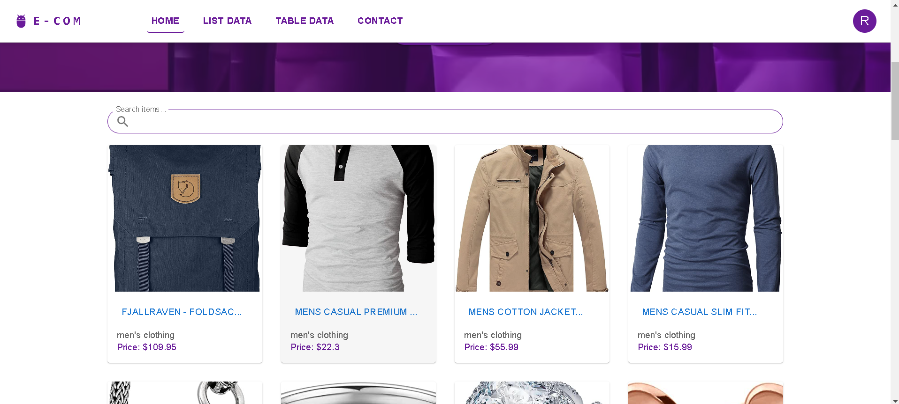

 # Gobananas Assignment

## Overview

This project is a front-end assignment for the Gobananas company. It is a React application that showcases various features and components, including a navbar, hero section, item list, contact page, and more. The project uses Material-UI for styling and React Router DOM for navigation.

## Check live project at :

(https://gobananas-assignment-blue.vercel.app/)

## Screenshots

## Home page

 the home page uses Fakestore API (https://fakestoreapi.com/products) to show product data image, title, product, description, etc.

## 1

## 2

## Contact page

## Installation

To run this project locally, follow these steps:

1. Clone this repository to your local machine using `git clone`.
2. Navigate to the project directory.
3. Install dependencies by running `npm install`.
4. Start the development server with `npm start`.
5. Open your web browser and visit [http://localhost:3000](http://localhost:3000) to view the project.

## Features

- **Navbar:** Provides navigation links to different pages.
- **Hero Section:** Displays a welcoming message and encourages users to explore the store.
- **Item List:** Fetches data from a fake API and displays a list of items.
- **Contact Page:** Allows users to submit inquiries or questions via a contact form.

## Dependencies

- @mui/icons-material
- @mui/material
- react-router-dom

## Conclusion

This project is a demonstration of front-end development skills using React. It incorporates various components and pages to create a dynamic user interface. By leveraging Material-UI for styling and React Router for navigation, it showcases a modern and responsive web application structure. With features like a navbar, hero section, item list, and contact page, it provides a seamless browsing experience. Whether you're exploring products or contacting support, this application offers a smooth interaction flow. Feel free to clone the repository and explore the codebase further.
